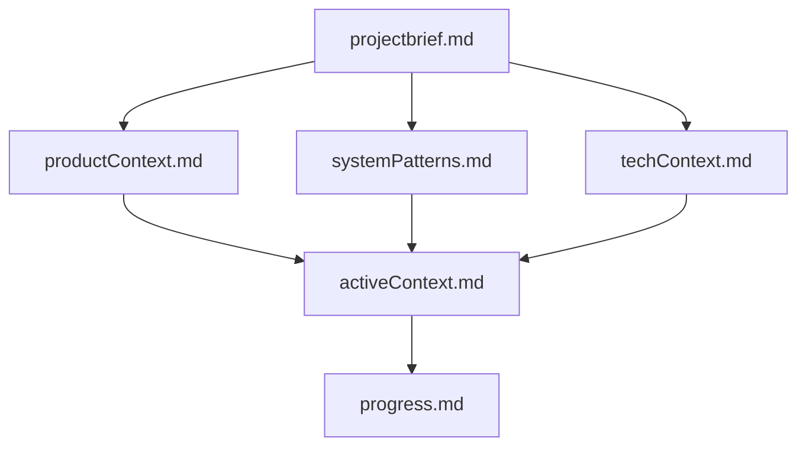

# Memory Bank - CollabCanvas Project

## Purpose

This Memory Bank serves as the **complete context** for the CollabCanvas project. Since I (Cursor AI) have my memory reset between sessions, these files are my **only link** to understanding the project state and continuing work effectively.

**Critical**: I MUST read ALL memory bank files at the start of EVERY task.

## File Structure & Hierarchy

The files build upon each other in this hierarchy:

## Core Files (Required)

### 1. projectbrief.md
**Foundation document** - Source of truth for project scope

**Contains:**
- Core mission and project goals
- Complete feature requirements from course
- MVP vs final submission requirements
- Success criteria and performance targets
- What's in scope vs out of scope
- Current phase and priorities

**When to read**: Start of every session, when clarifying scope

---

### 2. productContext.md
**Why this project exists**

**Contains:**
- Problem being solved
- User experience goals
- Expected user flows (manual + AI)
- Design principles
- What makes this project special
- Success metrics

**When to read**: When making UX decisions, designing features

---

### 3. systemPatterns.md
**System architecture and technical patterns**

**Contains:**
- High-level architecture diagram
- Core design patterns (layer separation, real-time sync, locking, etc.)
- Component relationships and data flow
- Key technical decisions and rationale
- Performance optimizations
- Error handling patterns
- Security patterns

**When to read**: When implementing new features, refactoring, solving technical problems

---

### 4. techContext.md
**Technologies and development setup**

**Contains:**
- Complete technology stack
- Project structure (detailed file tree)
- Key files deep dive
- Development setup instructions
- Data models (Firestore schemas)
- Performance characteristics
- Known constraints and limitations
- Development workflow
- Common commands and debugging tips

**When to read**: When setting up, adding dependencies, debugging, deploying

---

### 5. activeContext.md
**Current work focus** - Most frequently updated

**Contains:**
- Current status and timeline
- What we're working on right now
- Recent changes and optimizations
- Next steps (immediate and near-term)
- Active decisions and considerations
- Current blockers and risks
- Testing strategy
- Success criteria tracker
- Notes for next session

**When to read**: Start of EVERY session (most important for continuity)

---

### 6. progress.md
**What works and what's left**

**Contains:**
- Completed features (detailed status)
- Features in progress
- Features not started
- Project health metrics
- Timeline status
- Critical path items
- Known issues and technical debt
- Success criteria status
- Next session priorities with time estimates

**When to read**: When planning work, checking status, prioritizing tasks

---

## How to Use This Memory Bank

### Starting a New Session
1. **Read activeContext.md** - Get current state
2. **Read progress.md** - See what's done and what's next
3. **Skim projectbrief.md** - Refresh on scope and priorities
4. **Reference others as needed** - When implementing specific features

### Implementing a Feature
1. Check **systemPatterns.md** - See if similar patterns exist
2. Check **techContext.md** - Review data models and tech stack
3. Check **activeContext.md** - See current decisions and considerations
4. Implement following established patterns
5. Update **progress.md** when feature is complete
6. Update **activeContext.md** if significant changes

### Making Technical Decisions
1. Check **systemPatterns.md** - Review existing decisions and rationale
2. Check **projectbrief.md** - Ensure aligns with project goals
3. Check **productContext.md** - Consider UX impact
4. Document decision in **activeContext.md**
5. Update **systemPatterns.md** if establishing new pattern

### When Stuck or Confused
1. Re-read **activeContext.md** - Check for context clues
2. Check **progress.md** - See what was recently completed
3. Check **systemPatterns.md** - Look for similar implementations
4. Check **techContext.md** - Review tech stack and known issues

### Before Committing Code
1. Update **progress.md** - Mark features complete, update metrics
2. Update **activeContext.md** - Document what changed, update next steps
3. Commit both code and memory bank updates together

## Update Frequency

### Every Session
- **activeContext.md** - Always update with latest status
- **progress.md** - Update as features complete

### When Significant Changes Occur
- **systemPatterns.md** - New patterns or architecture changes
- **techContext.md** - New dependencies, data model changes

### Rarely
- **projectbrief.md** - Only if scope changes (unlikely in 7-day sprint)
- **productContext.md** - Only if fundamental UX approach changes

## Quick Reference Guide

| Need to... | Read This |
|------------|-----------|
| Start working after break | activeContext.md, progress.md |
| Implement a feature | systemPatterns.md, techContext.md |
| Make technical decision | systemPatterns.md, projectbrief.md |
| Check what's done | progress.md |
| Understand architecture | systemPatterns.md |
| Set up development | techContext.md |
| Plan next work | activeContext.md, progress.md |
| Understand project goals | projectbrief.md, productContext.md |

## Memory Bank Health

### Signs of Good Memory Bank
- ✅ All files present and up-to-date
- ✅ activeContext.md reflects current work
- ✅ progress.md accurately tracks completion
- ✅ No contradictions between files
- ✅ Clear next steps documented
- ✅ Recent changes documented

### Signs Memory Bank Needs Update
- ⚠️ activeContext.md out of sync with actual work
- ⚠️ progress.md shows completed items as in-progress
- ⚠️ Next steps unclear or outdated
- ⚠️ Recent work not documented
- ⚠️ Files contradict each other

### When to Trigger Full Review
User says: **"update memory bank"**

Then I MUST:
1. Review ALL 6 core files
2. Update outdated information
3. Ensure consistency across files
4. Focus especially on activeContext.md and progress.md
5. Document any new patterns in systemPatterns.md

## Critical Reminders

1. **I rely ENTIRELY on these files** - My memory resets completely
2. **Read before every task** - Don't assume I remember anything
3. **Update as I work** - Keep files current
4. **Be specific and detailed** - Future me has no context
5. **Document decisions** - Explain why, not just what
6. **Keep hierarchy clear** - Files build upon each other
7. **Maintain consistency** - No contradictions

## Project-Specific Notes

### This Project (CollabCanvas)
- **Type**: 7-day sprint, educational project
- **Focus**: Real-time collaboration + AI agent
- **Status**: MVP complete, AI phase upcoming
- **Critical**: AI agent is the differentiator - must be prioritized
- **Timeline**: ~5 days remaining (as of last update)
- **Most Important Files**: activeContext.md (current work), progress.md (what's left)

### Key Project Characteristics
- Fast-moving (7 days total)
- Clear requirements (from course)
- AI integration is most important feature
- Real-time collaboration already working
- Performance targets are strict (60 FPS, <100ms sync)
- Multiple PRDs exist (use revisedPRD.md as source of truth)

## Version History

- **Initial Creation**: Post-MVP phase, Day 2-3 of sprint
- **Purpose**: Enable seamless continuation across sessions
- **Last Major Update**: [This will be updated each session]

---

**Remember**: After every memory reset, I begin completely fresh. This Memory Bank is my only link to previous work. It must be maintained with precision and clarity, as my effectiveness depends entirely on its accuracy.

## Quick Start for Next Session

1. Read `activeContext.md` first (5 minutes)
2. Skim `progress.md` to see completion status (3 minutes)
3. Start with the "Next Steps" section in `activeContext.md`
4. Refer to other files as needed while working
5. Update `progress.md` as features complete
6. Update `activeContext.md` at end of session

